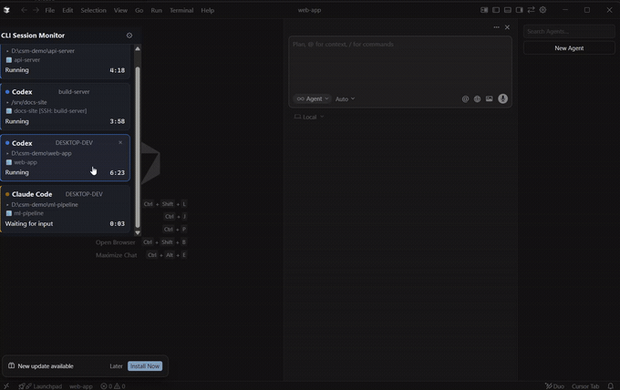

<p align="center">
  
</p>

<h1 align="center">CLI Session Monitor</h1>

<p align="center">
  <a href="https://github.com/reearner/cli-session-monitor/releases/latest"></a>
  <a href="https://github.com/reearner/cli-session-monitor/actions/workflows/ci.yml"></a>
  <a href="./LICENSE"></a>
  
  
</p>

<p align="center">
  <b>See which of your Claude Code / Codex sessions is running, waiting for you, or
  done — at a glance, and jump to any of them in one click.</b>
</p>

> A lightweight Windows desktop widget that shows, at a glance, the live status
> and run time of every **Claude Code** / **Codex** CLI session you have open —
> running, waiting for your input, or finished — and notifies you on completion.
> Collapses to a floating ball that docks to a screen edge; click a session to
> jump straight to its editor window.

> Status: **early development (0.1.0)**. Windows-first. MIT-licensed.

<p align="center">
  
  <br/>
  <sub>Demo mode (<code>CSM_DEMO</code>) — synthetic sessions, not real data.</sub>
</p>

<p align="center">
  <a href="https://github.com/reearner/cli-session-monitor/releases/latest"><b>⬇ Download for Windows</b></a>
  &nbsp;·&nbsp;
  <a href="#install">Install</a> · <a href="#features">Features</a> ·
  <a href="docs/GUIDE.md">User Guide</a> (<a href="docs/GUIDE.zh.md">中文</a>) ·
  <a href="#how-it-works">How it works</a> · <a href="#build-from-source">Build</a>
</p>

## Why

When you run several CLI coding sessions in parallel, the terminal gives no
reliable signal for "is this one still thinking, waiting for me, or done?" — the
process just stays resident. This tool listens to each CLI's **deterministic
lifecycle signals** and surfaces them into one always-on widget, so you stop
tab-switching to check.

## Features

- 🟢 **Live status per session** — `running` (with a live timer), `waiting for
  your input`, or `idle`; desktop notification + flash when a turn finishes.
- 🫧 **Floating-ball mode** — collapses to a small orb that docks to the nearest
  screen edge as a thin bar showing counts (▶ running / ! awaiting input);
  hidden from the taskbar and Alt-Tab; remembers its position across restarts.
- 🎯 **Click to jump** — click a session card to focus its **Cursor / VS Code**
  window (including ones opened via **Remote-SSH**); it remembers which editor a
  folder uses and reopens that one.
- 🛰️ **Remote sessions, no SSH** — run a small agent on a remote box; it relays
  session status to the desktop over an [ntfy](https://ntfy.sh) topic. Only
  metadata crosses the wire — never conversation content.
- 🔔 **System tray** — show/hide, reset position, quit. Closing hides to tray.
- ⚙️ **Optional autostart** on login. All desktop-resident options default **off**.

## Install

**[⬇ Download the latest Windows installer](https://github.com/reearner/cli-session-monitor/releases/latest)**,
run it, and launch **CLI Session Monitor** — that's it. WebView2 ships with
Windows 11.

> The build isn't code-signed yet, so SmartScreen may warn on first run: choose
> **More info → Run anyway**. Prefer to build it yourself? See
> [Build from source](#build-from-source).

## Usage

> 📖 **Full step-by-step walkthrough — including Remote-SSH — is in the
> [User Guide](docs/GUIDE.md)** ([中文](docs/GUIDE.zh.md)). The quick version:

1. **First run** — open **Settings** (gear icon) and enable the **Claude Code**
   integration (one-click, append-only and reversible — it adds the hooks that
   report session lifecycle). **Codex** needs nothing: it's watched read-only
   from its rollout files. Optionally set the idle threshold, autostart, and the
   remote relay here too.
2. **Read status at a glance** — one card per session with a colored dot + label
   (running / waiting for input / idle) and a live timer. The card whose editor
   window you're currently in is **highlighted**. (UI follows your locale —
   English / 中文.)
3. **Click a card** to focus its **Cursor / VS Code** window (including ones
   opened via **Remote-SSH**). Each card also shows its launch directory (`▸`)
   and the matched window (`🪟`).
4. **Close a card** with its **×** — it comes back if that session acts again.
5. **Collapse to a floating ball** — click the title bar. The ball docks to the
   nearest screen edge as a thin bar showing counts (▶ running / ! awaiting
   input); hover to pop it back to a ball, click to reopen the panel, drag it
   anywhere to re-dock. It pulses on a completion / waiting event, and remembers
   its position across restarts.
6. **System tray** — show/hide, reset the ball's position, or quit. Closing the
   window hides to the tray rather than exiting.

> Tip: `CSM_DEMO=1` launches a self-contained demo (synthetic sessions, fake
> host/paths, nothing read or sent) — handy for a first look.

## How it works

Decoupled by a tiny **local file bus** (`~/.cli-session-monitor/events/`):

```
Claude Code (hooks) ──► session-reporter ──► events/*.json ─┐
Codex (rollout files, read directly) ──────────────────────┤──► Tauri desktop app
remote csm-agent ──► ntfy topic ──► app subscribes ─────────┘    (watch → state machine → UI + tray)
```

- **`session-reporter`** — a tiny Rust binary invoked by Claude Code hooks. It
  normalizes the hook payload into a unified event and writes it atomically to
  the file bus. **It never blocks or breaks your CLI** (short timeout, always
  exits 0) and **only records metadata** (session id, directory, timestamp,
  event kind) — never conversation content.
- **Codex** is watched by reading its per-session rollout files
  (`~/.codex/sessions/**/rollout-*.jsonl`) directly — **no config change, no
  install**. Read-only, metadata only.
- **Desktop app** (Tauri, Rust + vanilla TS) — watches the bus, runs a state
  machine, renders compact cards with live timers, and (Windows) reads running
  `codex.exe` / `claude.exe` working directories to tell which sessions are
  actually open.
- **`csm-agent`** — the remote-side binary; reuses the same watchers and
  publishes events to your ntfy topic. Cross-platform (a static Linux build is
  supported); the desktop app is Windows-only.

## Notes & limitations

- **Windows-only desktop app.** The core crates build cross-platform, but the
  GUI, window-jump, and process detection are Windows-only.
- **Jump & highlight rely on the window title.** Matching uses the editor
  window's folder as shown in its title. If two open folders share a basename,
  enable **Settings → Optimize jump** (writes a reversible `window.title`
  setting) so they can be told apart; without it a card may read "no matching
  window" or not highlight.
- **Jump focuses a window, not a terminal tab.** Several CLIs running in one
  editor window all map to that window — clicking any of them focuses it (there's
  no Win32 way to target an individual integrated-terminal tab).
- **Codex timing is approximate** (shown as `est.`): it reports turn completion
  without a clean start, so durations are best-effort.
- **Early development (0.1.0)** — expect rough edges; issues and PRs welcome.

## Privacy

- **Local by default** — nothing leaves your machine unless you turn on the
  remote relay.
- **Remote relay (opt-in)** sends only the event metadata (source, host, working
  directory, status, timestamps) to the ntfy topic you configure. Public
  `ntfy.sh` topics are readable by anyone who knows the topic, so use a
  hard-to-guess topic and/or a **self-hosted ntfy + access token** for anything
  sensitive.
- Conversation content is **never** read or transmitted.

## What it writes to your config (transparency)

The one-click installer is append-only, backup-first (a timestamped
`<file>.bak.<epoch-ms>` is written before any change), idempotent, and
reversible; uninstall removes only what it added. If a config file can't be
parsed, it aborts and leaves the file untouched.

- **Claude Code** (`~/.claude/settings.json`): appends a `session-reporter`
  command hook under `UserPromptSubmit`, `PreToolUse`, `PostToolUse`, `Stop`,
  `Notification`, and `SessionEnd`. Your existing settings/hooks are preserved;
  uninstall removes only entries carrying our `--source claude` flag.
- **Codex**: nothing — watched read-only via rollout files. (The installer can
  remove a stale `notify` from an older version if present.)
- **Editor jump (optional)** — "Optimize jump" writes a `window.title` setting
  into VS Code / Cursor user settings (backup-first, reversible) so windows
  whose folders share a basename can be told apart.

## Build from source

Requires the **Rust** toolchain (MSVC) + **Node**. WebView2 ships with Windows 11.

```bash
# tests (pure logic — no CLI or GUI needed)
cargo test

# frontend deps + typecheck
npm install
npm run typecheck

# dev (hot reload)
npm run tauri dev          # or: npx @tauri-apps/cli@2 dev

# release build (produces the app + an installer under src-tauri/target/release/)
npm run tauri build        # or: npx @tauri-apps/cli@2 build
```

The cross-platform crates (`csm-core`, `csm-reporter`, `csm-watch`, `csm-agent`)
build on Linux/macOS too; the **desktop app, window-jump and process detection
are Windows-only** (other platforms compile with no-op stubs).

### Try it without any setup (demo mode)

Set `CSM_DEMO=1` and launch — the app starts with a spread of synthetic
sessions (running / waiting / done, plus a remote one) with live timers and
periodic flashes, using a fake hostname and paths. No CLI, hooks, or real data
needed; nothing is read from disk or sent anywhere. Great for a first look or a
screen recording.

```powershell
$env:CSM_DEMO=1; .\target\release\cli-session-monitor.exe
```

### Remote monitoring

See sessions running on a remote server, no SSH needed. The link between the two
sides is an **[ntfy](https://ntfy.sh) topic**: the desktop app **subscribes** to
one topic, and a small agent on the remote **publishes** to that **same** topic.
Use one topic and run the agent on each remote you want to watch — they all show
up in the one app.

**Easiest path — export the launcher (Settings → Remote):**

1. Open **Settings → Remote**. Set a **hard-to-guess topic** (or just click
   *Export* and one is generated for you). Optionally set a self-hosted relay URL
   and an access token.
2. Click **Export remote script** — it writes `remote-agent.sh` (to
   `~/.cli-session-monitor/`) with the topic/URL/token **baked in**.
3. Copy that `remote-agent.sh` to the remote host, alongside a Linux **`csm-agent`**
   binary (or run it inside a checkout of this repo so it can `cargo build` one).
4. On the remote, run it:

   ```bash
   bash remote-agent.sh
   ```

5. The desktop app (subscribed to that topic) now shows the remote's sessions. If
   you just set the topic, **restart the app** so it subscribes.

> The script differs between topics only in the `CSM_RELAY_TOPIC=` line; the rest
> is identical. The desktop only sees the **one** topic it's subscribed to, so run
> the **same** topic on every remote you want in one view.

**Manual alternative** (no export):

```bash
cargo build --release -p csm-agent
CSM_RELAY_TOPIC=<same-topic-as-the-app> ./target/release/csm-agent
```

> **Privacy:** a public `ntfy.sh` topic is readable by anyone who knows it — use a
> hard-to-guess topic and/or a self-hosted ntfy + token. Only metadata (source,
> host, directory, status, timestamps) is published — never conversation content.

See `docs/DESIGN.md` for the architecture; `docs/REMOTE-DESIGN.md` for the remote
design.

## Contributing

Issues and PRs welcome — it's early days. See [CONTRIBUTING.md](./CONTRIBUTING.md)
for the project layout, build/test commands, and the ground rules (the reporter
must never block your CLI; metadata only; pure, testable state machine). Please
follow the [Code of Conduct](./CODE_OF_CONDUCT.md), and report security/privacy
issues per [SECURITY.md](./SECURITY.md).

Found it useful? **⭐ Star the repo** — it helps others find it.

## License

[MIT](./LICENSE) © reearner and contributors
