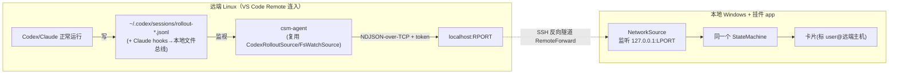

# 远程支持设计文档（Remote Codex / Claude）

> ## 已实现方案：ntfy 中继（无需 SSH）✅
>
> 最终落地的不是下文的 SSH 隧道方案，而是更简单的 **ntfy 发布/订阅中继**：
>
> - 远端跑 `csm-agent`（复用 `csm-watch` 的 `CodexRolloutSource` / `FsWatchSource`），
>   把归一化后的 `Event`（仅元数据）**POST 到一个 ntfy 主题**。
> - 桌面端的 `NtfySource` **订阅同一主题**，事件进入与本地完全相同的状态机；
>   远端会话按 `host` 区分、与本地并列显示。
> - 配置：`relay_url`（默认 `https://ntfy.sh`，可自托管）/ `relay_topic` / `relay_token`。
>   设置页可**一键导出 `remote-agent.sh`**（主题已内置）。
> - 隐私：只传元数据、不传正文；公共 ntfy 主题任何知道主题名的人都可读，敏感场景请用
>   **难猜的主题 + 自托管 ntfy + 访问令牌**。
> - 优点：**不依赖 SSH/隧道**，远端只需能访问 ntfy；手机只是同一主题的另一个订阅者。
>
> 下文保留**原 SSH 隧道设计稿**作为备选/参考（未采用）。

---

## 附：原 SSH 隧道设计稿（备选，未采用）

> 状态：**备选设计**（未实现；最终采用上面的 ntfy 中继）。
> 主场景：用户用 **VS Code Remote（SSH）** 连远端 Linux 服务器，在其中跑 Codex / Claude Code。
> 目标：远端会话像本地一样**自动识别**（运行中/等待审批/已完成 + 实时计时），且一条脚本完成接入、自动常驻。

---

## 1. 目标与非目标

**目标**
- 远端 Codex/Claude 会话自动出现在本地挂件，状态与本地一致（运行中/等待审批/已完成、实时秒表、真实耗时）。
- 远端 agent **常驻自启**：用户一开 Claude/Codex 就被识别，无需每次手动操作。
- **脚本化接入**：尽量一条命令配置好（远端 agent + 自启 + 本地 ssh 反向转发 + token）。
- 复用现有架构：不改状态机/UI 的核心；事件 schema 已含 `host`，`SessionKey` 已含 `host`。
- 隐私：只传元数据、不传对话正文；走 SSH 隧道加密、回环绑定、带 token；无第三方中继。

**非目标（本期）**
- "完全无 SSH / 手机跨设备查看" —— 留给后续"中继/pub-sub"形态（见 §12）。
- 远端 GUI（远端只跑无界面的 agent；UI 永远在本地）。
- 多远端同时（架构支持，但本期先把单远端打通）。

---

## 2. 为什么远端需要一个 agent

本地版监视的是**本机文件**：`~/.codex/sessions/`（rollout）、`~/.cli-session-monitor/events/`（文件总线）。远端 Codex 的 rollout 在**远端磁盘**，本地看不到。

而"运行中 / 等待审批"这些状态**只存在于 rollout 的实时事件流里**（`task_started` / `*_approval_request` / `task_complete`）。要在远端捕获它们，就必须有个进程**在远端**读这些文件——这就是 `csm-agent`。agent 把归一化后的 `Event`（仅元数据）通过隧道推回本地。

---

## 3. 总体架构



要点：
- agent 复用本地已写好的 `CodexRolloutSource`（和可选 `FsWatchSource`）——**同一套监视逻辑**，只是输出端换成网络。
- 事件经 **SSH 反向隧道**（`RemoteForward`）从远端 `localhost:RPORT` 透传到本地 `127.0.0.1:LPORT`。对两端程序都表现为"本地回环连接"，因此**无需任何公网、无第三方**。
- 本地 `NetworkSource` 收到事件后喂进**同一个状态机**，与本地事件无差别处理；`host` 字段区分来源。

---

## 4. 传输：隧道内 NDJSON-over-TCP

不引入 HTTP 库（更轻、更稳）。隧道内是私有点对点连接，用极简协议：

- **连接**：agent 连到 `127.0.0.1:RPORT`（被反向转发到本地 `LPORT`）。
- **握手**：第一行发送 `token`（与本地约定的共享密钥）；本地校验，不符即断开。
- **事件**：此后每行一个 `Event` 的 JSON（NDJSON），即现有 schema：
  ```json
  {"schema":1,"source":"codex","session_id":"<thread-id>","cwd":"/home/u/proj","host":"u@gpu01","event":"run_start","ts":...}
  ```
- **心跳**：每 N 秒发一行 `{"schema":1,...,"event":"heartbeat"}` 或空行保活（可选）；断线 agent 自动重连。

为什么不用 HTTP：隧道内只有我们两端，省去 HTTP 库与异步运行时；`std::net::TcpStream/TcpListener` + `serde_json` 足矣，依赖零增加。

---

## 5. host 标识与去重

- agent 把 `host` 设为远端标识（如 `用户@主机名`，用 `gethostname` + 用户名）。
- `SessionKey = (source, host, session_id)` 已含 `host` → 远端会话与本地、与其他远端**天然不撞**。
- UI 后续可按 `host` 分组展示（本期至少在卡片上显示 `host`，分组可选）。

---

## 6. 一键接入脚本（核心体验）

接入分**远端**与**本地**两侧，提供脚本覆盖：

**远端侧 `install-remote.sh`（在远端执行，或经 ssh 远程执行）**
1. 准备 agent 二进制（见 §7）。
2. 写 agent 配置：推送地址 `127.0.0.1:RPORT`、token、要监视的目录（`~/.codex/sessions`、可选本地文件总线）。
3. **设为自启**：优先 `systemd --user`（`systemctl --user enable --now csm-agent`），无 systemd 则退化为登录 shell rc 里 `nohup csm-agent &` 守护。→ 这样**一开终端/登录就自动跑**，满足"开 Claude/Codex 即被识别"。

**本地侧 `install-local.ps1`（在本地执行）**
1. 在 `~/.ssh/config` 对该主机**追加**：
   ```
   Host <your-remote>
       RemoteForward 127.0.0.1:RPORT 127.0.0.1:LPORT
   ```
   （只追加、写前备份、幂等——沿用安装器红线。VS Code Remote-SSH 走系统 ssh，会读此配置。）
2. 生成/写入共享 token（本地 app 与远端 agent 共用）。
3. 本地 app 配置里开启 `remote_listen`（端口 LPORT、token）。

> 端口选择：默认固定一对（如 LPORT=47615 / RPORT=47615），可在脚本参数覆盖；token 随机生成一次。

---

## 7. agent 的构建与分发（Linux）

agent 要在远端 Linux 上跑，需 Linux 二进制。三种方式，脚本按可用性选择：
1. **在远端构建**（推荐）：远端若有/可装 rustup，则 `cargo build --release -p csm-agent`。最稳，零跨平台坑（远端原生 gcc）。
2. **预编译下发**：CI 产出 `x86_64-unknown-linux-gnu`（和 musl 静态版）二进制，脚本 `scp`/下载到远端。免远端装 Rust。
3. **cross/zig 交叉编译**：从开发机交叉编 Linux（`cargo-zigbuild` 等）。复杂度中等。

本期建议：脚本优先走 ① 或 ②（musl 静态单文件最省事）。

---

## 8. 本地 NetworkSource

- 在 `src-tauri` 新增 `source/net.rs`：`NetworkSource { bind: SocketAddr, token }`，实现现有 `Source` trait。
- `127.0.0.1:LPORT` `TcpListener`；每连接：校验首行 token → 逐行 `serde_json::from_str::<Event>` → `tx.send`（喂进与本地相同的 channel/状态机）。
- 仅绑回环（`127.0.0.1`），不监听外网。坏行跳过不崩；连接断开可重连。
- 受配置开关控制（默认关；开启需 token + 端口）。

---

## 9. 共享 watcher crate（必要的重构）

当前 `Source` trait、`FsWatchSource`、`CodexRolloutSource` 在 `src-tauri/src/source/`（属 bin，无法被别的 crate 复用）。为让 `csm-agent` 复用同一监视逻辑：

- 新建 lib crate **`crates/csm-watch`**，把上述三者迁入；`src-tauri` 与 `csm-agent` 都依赖它。
- `NetworkSource`（本地收）放 `src-tauri`（仅 app 用）；`TcpSink`（远端发）放 `csm-watch` 或 `csm-agent`。
- 纯机械迁移 + 改 `use` 路径；迁移后跑全量测试确认无回归（现 70 测试）。

---

## 10. 安全与隐私

- **只传元数据**：`Event` 不含对话正文（rollout 的 `last_agent_message` 等永不读取，已有红线 + 测试）。
- **鉴权**：握手 token；token 不符即拒。
- **加密 + 点对点**：走用户自己的 SSH 隧道；两端均绑 `127.0.0.1`，不暴露公网；无第三方中继。
- **可选脱敏**：提供"隐去/截断 cwd 路径"开关（Req 8）。
- **透明**：脚本改了哪些文件（ssh config、systemd unit）、token 存哪、如何卸载，全部文档化 + 备份。

---

## 11. 可靠性

- agent：隧道未就绪/断开 → 指数退避重连；本地 app 未起 → 重试；不阻塞、不影响远端 CLI。
- app NetworkSource：坏数据跳过；多连接容忍；agent 重连产生新连接正常接管。
- 去重：同 `(source,host,session_id)` 收敛为一张卡；远端与本地互不干扰。
- 启动恢复：agent 启动时与本地 rollout 监视一致——只处理启动后的新增事件（不回放历史）。

---

## 12. 限制与未来

- **本期依赖 SSH/VS Code Remote**（反向隧道）。你之前提的"**可能无 SSH / 手机跨设备看**"不在本期——那需要**中继/pub-sub**（自托管中继 或 ntfy 式）：agent 推到中继、各观看端订阅。架构（可插拔 sink/source + host）已为此留好，后续加一个 `RelaySink`/`RelaySource` 即可，不返工。
- agent 必须在远端常驻（脚本设自启解决）。
- "等待审批"仍需**交互式 Codex**（`codex exec` 自动批准不会停下问你）——与本地一致。

---

## 13. 改动清单（评审重点）

| 改动 | 位置 | 性质 |
|------|------|------|
| 抽共享 watcher crate | 新 `crates/csm-watch`（迁移现有 source/） | 重构（有回归风险，靠测试兜底） |
| 远端 agent | 新 `crates/csm-agent`（bin） | 新增 |
| TcpSink（发） | `csm-watch` 或 agent | 新增 |
| NetworkSource（收） | `src-tauri/src/source/net.rs` | 新增 |
| app 装配 + 配置开关 | `src-tauri`（main、config） | 小改 |
| 一键脚本（远端自启 + 本地 ssh config） | `scripts/` | 新增 |
| CI 产 Linux agent 二进制 | `.github/workflows` | 新增（配合任务 17） |

**验证**：本地用 loopback 跑通 `csm-agent → 127.0.0.1 → NetworkSource → 状态机 → 卡片`（证明数据路径）；真实远端 + SSH 隧道段由用户在自有服务器验证（开发机无远端环境）。

---

## 14. 待你拍板的点

1. 传输：**反向 SSH 隧道 + NDJSON-over-TCP**（本设计主线）是否 OK？
2. agent 分发：远端构建 vs 预编译 musl 单文件下发——倾向哪种？
3. 自启方式：`systemd --user` 优先、无则 shell rc 守护——可否？
4. 端口/`token`：默认固定端口 + 随机 token，可否？
5. 范围：本期只做"反向隧道单远端"，"无SSH/跨设备中继"留后续——可否？
